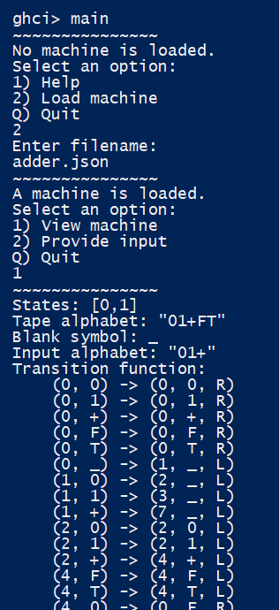

# Turing Machine Simulator and Visualizer

## Overview
This is a Turing machine simulator and visualizer written in Haskell.

Run `main` to begin the simulator. Following the UI prompts, you can:
- Load a JSON file containing a Turing machine definition.
- Provide an input (the machine's initial tape contents).
- Run the machine step-by-step or until termination.

Note that a Turing machine may never terminate, which will cause the simulator to hang indefinitely.

## Input Format
The simulator accepts Turing machines defined in the following JSON format:

| JSON Key/Values      | Explanation                                                                  |
|-----------------------|-----------------------------------------------------------------------------|
| `{"states": [<integer>, ...]` | List of states used by the machine; a state is represented by an integer ID. |
| `"gamma": [<string>, ...],`   | Tape alphabet containing the symbols that may occur on the tape.             |
| `"blank": <string>,`          | The blank symbol. Recommended to use `"_"` or `" "`.                         |
| `"input": [<string>, ...],`   | Input alphabet containing the symbols that may occur on the initial tape.    |
| `"transitions": [`            | List of transition functions (each an object) that define machine operation. |
| `{ "from": <integer>,`        | The state at which this transition occurs.                                   |
| `  "read": <string>,`         | The symbol on the tape for this transition to occur.                         |
| `  "to": <integer>,`          | The state after making this transition.                                      |
| `  "write": <string>,`        | The symbol to write on the tape before moving.                               |
| `  "move": <"L"/"R"> },`      | How to move the head upon transitioning (`"L"` = left, `"R"` = right).       |
| `...],`                       | (Note: it is not required to define every possible transition)               |                                                          |
| `"start": <integer>,`         | The state to start the machine in.                                           |
| `"finals": [<integer>, ...]}` | List of states that are accept states.                                       |

You can view and run the sample machine for more help.

## Credits
All code and example machines created by Jason Moore.

---

## Examples
Here are some examples of the Turing machine simulator in action:

Loading a machine from a file and viewing its definition

Simulating the machine (step once and run all)